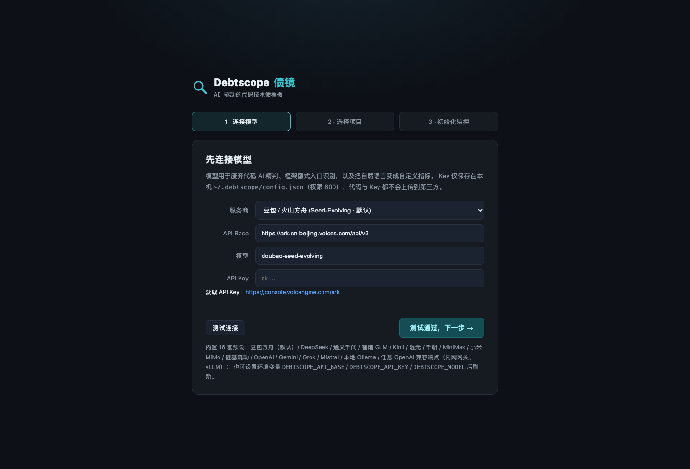
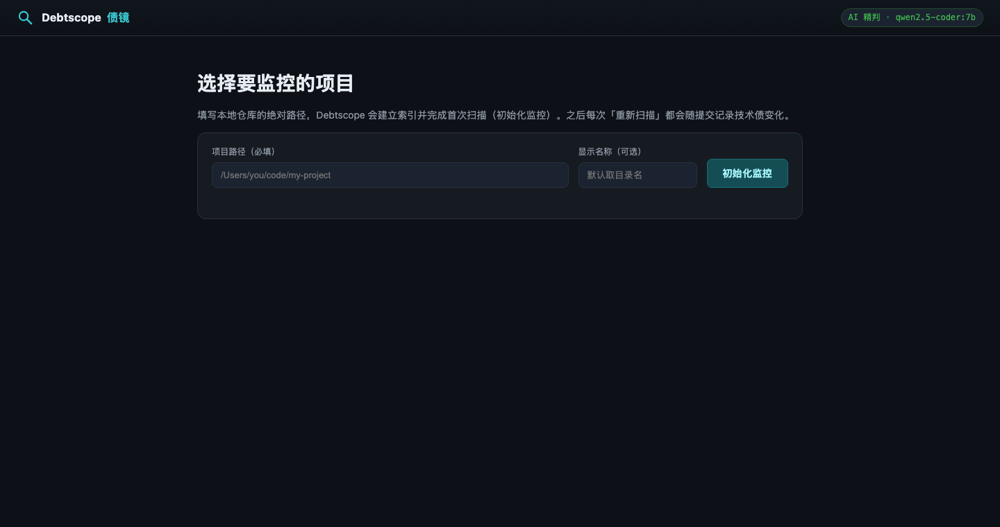
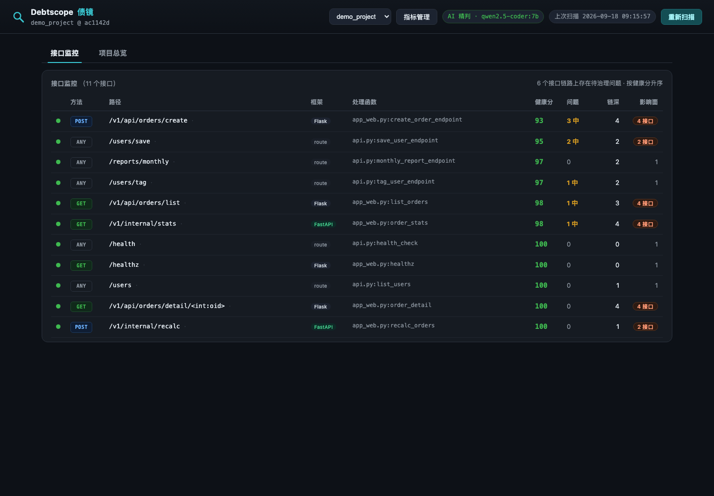
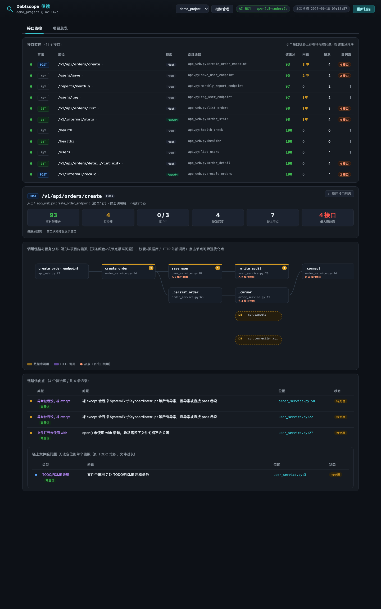
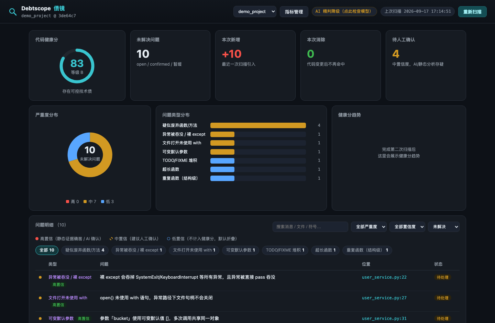
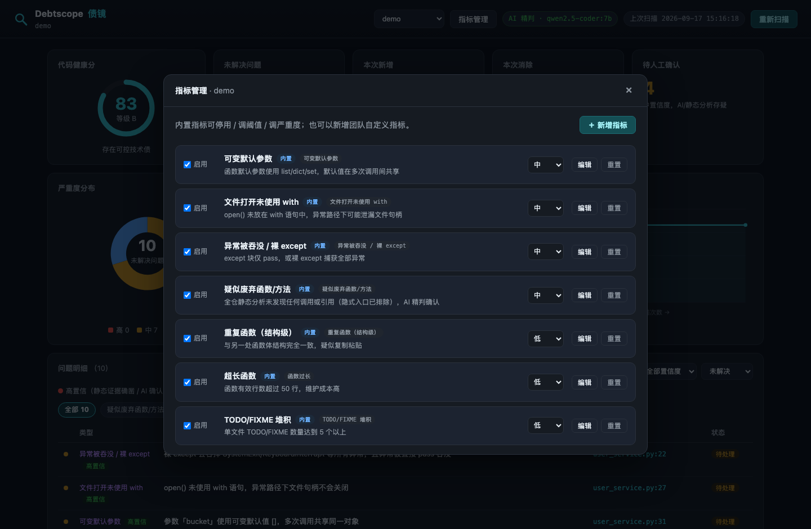
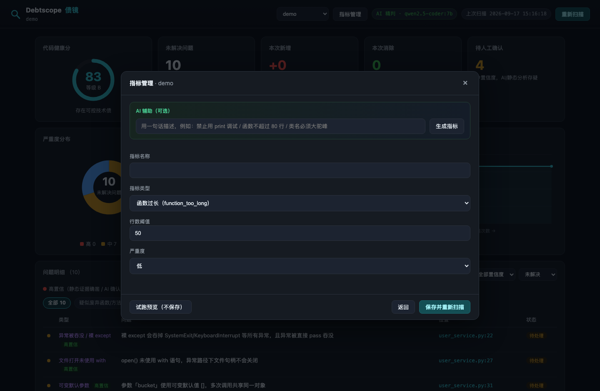
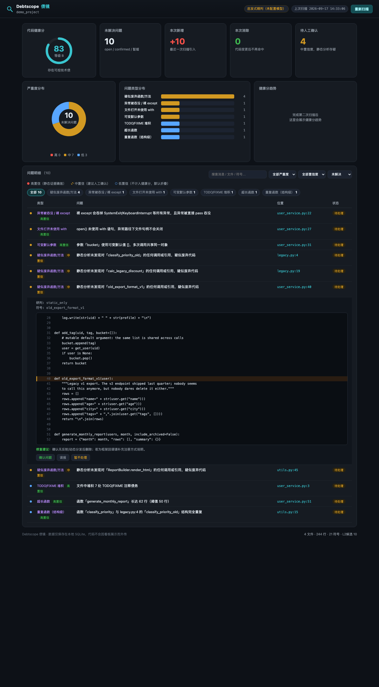
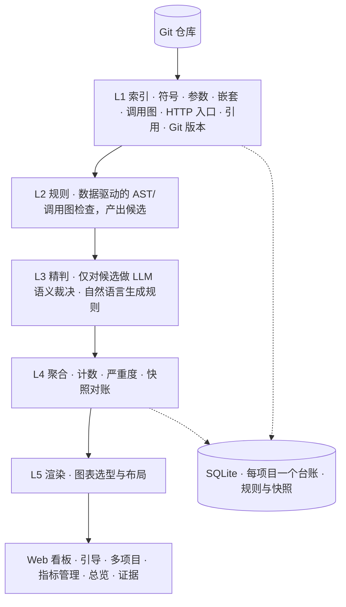

# 🔭 Debtscope · 债镜

<p>
  <a href="README.en.md">English</a> · <b>简体中文</b>
</p>

[](https://github.com/taoyongpan/Debtscope/actions/workflows/ci.yml)
[](https://www.python.org/)
[](LICENSE)
[](CONTRIBUTING.md)

**一句话，看清你的代码欠了多少债。**

配置模型 → 选择本地项目初始化监控 → AI 甄别技术债、用自然语言生成自定义指标 → 可视化看板随每次提交跟踪债务增减。

> Debtscope 回答三个团队长期答不上来的问题：技术债**有多少**、**具体在哪里**、我们正在变**好还是变差**？

- **零第三方依赖**：纯 Python 标准库实现，`git clone` 即可运行，无需数据库 / Docker / 服务端
- **接口雷达（v0.4）**：静态识别 Flask / FastAPI / 通用 `@route` 入口，构建跨文件调用链，把技术债挂到**每一个接口的链路节点**上；接口健康分、影响面（blast radius）排序、循环内 DB/HTTP（N+1）检测——**纯静态分析，不运行代码、不插桩、不做运行时监控 / APM**
- **确定性内核 + Agent 外壳**：AST 与调用图规则做全量粗筛，LLM 只精判 1%–5% 的候选，便宜、快、可复核
- **指标即数据**：内置规则可停用 / 调阈值 / 调严重度；8 类指标可在界面上自助新增，或**一句话让 AI 生成**，保存前先在当前仓库上试跑预览
- **多项目托管**：一个看板切换监控多个本地仓库，数据各自独立，全部留在本机
- **配置前置**：首次进入是「连接模型 → 选择项目 → 初始化监控」三步引导，默认豆包 Seed-Evolving，内置 16 套 OpenAI 兼容预设

---

## 为什么需要 Debtscope

| 能力 | SonarQube | AI 编程助手 | 人工 Code Review | **Debtscope** |
|---|---|---|---|---|
| 全仓技术债盘点 | ✅ | ❌ 仅编辑时 | ❌ | ✅ |
| 接口级调用链与链上债务定位 | 部分 | ❌ | 部分 | ✅ 静态链路图 + 每接口优化点 + 影响面 |
| 自然语言定义自定义指标 | ❌ 要写插件 | 部分支持 | ❌ | ✅ 一句话生成规则，带试跑预览 |
| 在界面里增删改自定义规则 | ❌ | ❌ | ❌ | ✅ 新增 / 编辑 / 停用 / 删除 / 重置 |
| 语义判定「死代码 vs 框架入口」 | ❌ 仅语法规则 | ✅ 但没有全仓视角 | ✅ 不可复现 | ✅ 确定性粗筛 + AI 精判 |
| 迭代间趋势叙事 | 弱 | ❌ | ❌ | ✅ 一等公民 |
| 多项目看板 | ❌ 重型服务端 | ❌ | ❌ | ✅ 本地注册表 |
| 可追溯证据 + 置信度分级 | 部分 | 弱 | ✅ | ✅ |
| 零依赖、本地运行 | ❌ | ✅ | — | ✅ 仅标准库 |

## 界面一览

<p align="center">
  
</p>

*① 首次启动是三步引导：连接模型 → 选择项目 → 初始化监控。默认选中**豆包 / 火山方舟（统一模型 ID `doubao-seed-evolving`，始终指向最新的 Agent & Coding 优化版本）**；下拉即可切换 DeepSeek、通义千问、智谱 GLM、Kimi、混元、千帆、MiniMax、小米 MiMo、硅基流动、OpenAI、Gemini、Grok、Mistral、本地 Ollama 或任意自定义端点。保存前可实时测试连接，本地端点无需 Key。*

<p align="center">
  
</p>

*② 填写本地仓库的绝对路径，Debtscope 建立索引并完成首次扫描（即初始化监控）。已监控项目以卡片展示，并常驻顶栏切换器。*

<p align="center">
  
</p>

*③ 「接口监控」是默认首页：静态发现的每一个 HTTP 接口按健康分排序，展示方法 / 路径 / 框架 / 处理函数、链上高 / 中危问题数、链路深度与**影响面**（一个底层函数被多少接口共用，改它的爆炸半径有多大）。*

<p align="center">
  
</p>

*④ 点进任一接口：跨文件调用链以分层 DAG 呈现——矩形是项目内函数（顶条颜色 = 该节点最严重的问题，角标是问题数，「↻ N 接口共用」标注热点），虚线胶囊是数据库 / HTTP 外部调用；下方列出这条链路上的全部优化点，点击节点即可只看该函数的问题，展开即见代码证据并可一键分诊。支持 `?ep=<接口ID>` 深链直达。*

<p align="center">
  
</p>

*⑤ 「项目总览」页：健康分环形图、本次新增 / 消除、严重度环形分布、问题类型条形分布、健康分趋势、可筛选的问题明细表；顶栏是项目切换、指标管理、模型徽章与重新扫描。*

<p align="center">
  
</p>

*⑥ 指标管理：启用 / 停用内置指标、调整严重度、编辑阈值，或新增团队专属指标。内置指标可一键重置回默认，自定义指标可删除。*

<p align="center">
  
</p>

*⑦ 用一句话描述指标——「禁止 print 调试」「函数不超过 80 行」「类名必须大驼峰」——AI 把它编译成带参数的确定性规则。**保存前在当前索引上试跑预览**（命中数量与样例位置），保存后自动重新扫描。*

<p align="center">
  
</p>

*⑧ 点击任意问题展开代码上下文（问题行高亮）、AI 研判结论、修复建议与一键分诊（确认问题 / 误报 / 暂不处理），支持 `#finding-<id>` 深链定位。*

## 工作原理

Debtscope **不会把整个仓库喂给大模型**。确定性的工作交给确定性的代码，模型只裁决一小批候选——这让扫描便宜、快速、可信。



**反幻觉防线**

1. **结构先行**——没有索引 / 调用图的结构证据，就不会产生任何问题。
2. **三位一体证据**——每条问题都带文件、行号、代码片段与引用链。
3. **置信度分级**——高 / 中（建议人工看一眼）/ 低（折叠且不计入健康分）。
4. **反馈闭环**——标记为「误报」的问题，以后每次扫描都会自动抑制。
5. **AI 生成的规则不被盲信**——它被编译成与内置规则完全相同的确定性检测器，且保存前必须在你的代码上试跑。
6. **模型故障不挡路**——网络、鉴权、限流或模型异常时，扫描自动降级为纯静态模式，并在 CLI、看板徽章与扫描摘要中**明确提示降级原因**，绝不静默。

死代码类问题的措辞始终诚实：*「静态分析未发现调用 / 引用，请人工确认」*——反射、动态分发与框架回调永远无法被静态分析完全排除。

### 确定性内核，Agent 外壳

Agent 外壳（`debtscope.harness`）遵循 DeepSeek Harness 普及的 **Agent = Model + Harness** 范式：可插拔模型适配、项目注册表、工具契约、可追溯运行；而内置规则始终走确定性快车道（快、免费、零幻觉）。模型只做只有模型能做的事：废弃代码的语义精判、把自然语言变成参数化规则。

v0.4.1 起 harness 内核已落地：微内核 + 工具注册中心 + 事件总线、8 个根目录限定的只读工具（调用图 / 读文件 / 正则搜索 / 规则目录与试跑 / 接口链路）、证据强制的 ReAct 循环（为兼容 16+ 家厂商采用文本 JSON 协议；**结论必须引用真实工具调用，判死代码前必须先查调用方，否则结论直接丢弃**）。废弃代码精判为两阶段：批量快判后，仅对模型拿不准的候选让 Agent 主动调工具补证据（每扫描上限 5 个、每个最多 5 步，`DEBTSCOPE_AGENT_REVIEW=0` 可关）。每次扫描都生成 JSONL 运行轨迹（工具调用、token 用量、问题采纳 / 驳回），用 `debtscope runs` 或 `GET /api/runs` 回看。完整设计见 **[docs/harness-architecture.md](docs/harness-architecture.md)**。

## 快速开始

需要 Python 3.10+，**零第三方依赖**（只用标准库）。

```bash
git clone https://github.com/taoyongpan/Debtscope.git
cd Debtscope

# 启动 Web 应用，三步引导带你完成 模型 → 项目 → 首次扫描
python -m debtscope serve
```

1. **连接模型**——引导默认豆包 / 火山方舟的 `doubao-seed-evolving`，粘贴方舟 API Key 即可；也可以切换到 DeepSeek / OpenAI / 本地 Ollama（无需 Key）。进入下一步前会实时测试连接。
2. **选择项目**——填写本地仓库的绝对路径，立即执行首次扫描、初始化监控。
3. **进入看板**——随时在顶栏切换已监控项目，「＋ 添加项目…」可继续添加。

> 默认端口 8787 被占用时会自动顺延寻找可用端口；浏览器会打开实际端口。

也可以安装为命令行工具：

```bash
pip install -e .          # 或 pip install debtscope（发布到 PyPI 后）
debtscope serve
```

CLI / CI 用法：

```bash
debtscope config                        # 一次性交互式模型配置
debtscope scan /path/to/repo            # 扫描并记录快照（需已配置模型）
debtscope scan /path/to/repo --no-llm   # 纯静态模式，不调用模型（CI / 离线兜底）
debtscope serve [path]                  # Web 看板，可顺带注册并打开某项目
```

> 产品设计上**默认要求配置模型**：Debtscope 是 AI-first 产品，拒绝把未经精判的静态结果当作默认体验静默呈现。`--no-llm` 仅作为 CI / 离线场景的显式逃生舱。

### 模型配置

```bash
debtscope config        # 引导式配置向导，写入 ~/.debtscope/config.json（权限 600）
debtscope doctor        # 随时检查配置与模型连通性
debtscope config --show # 查看当前生效配置（Key 脱敏）
```

内置 16 套预设，全部说 OpenAI Chat Completions 协议。引导默认**豆包 / 火山方舟**，其余在下拉中选择；API Base 与模型 ID 均已预填且可编辑。

| 服务商 | API Base | 默认模型 |
|---|---|---|
| **豆包 / 火山方舟**（默认） | `https://ark.cn-beijing.volces.com/api/v3` | `doubao-seed-evolving` |
| DeepSeek | `https://api.deepseek.com/v1` | `deepseek-chat` |
| 阿里通义千问 / 百炼 | `https://dashscope.aliyuncs.com/compatible-mode/v1` | `qwen3-coder-plus` |
| 智谱 GLM | `https://open.bigmodel.cn/api/paas/v4` | `glm-5.3` |
| Kimi / 月之暗面 | `https://api.moonshot.cn/v1` | `kimi-k2.6` |
| 腾讯混元 | `https://api.hunyuan.cloud.tencent.com/v1` | `hunyuan-turbo` |
| 百度千帆 / 文心 | `https://qianfan.baidubce.com/v2` | `ernie-4.5-turbo-128k` |
| MiniMax 海螺 | `https://api.minimax.chat/v1` | `MiniMax-M2.5` |
| 小米 MiMo | `https://api.xiaomimimo.com/v1` | `mimo-v2.5-pro` |
| 硅基流动 SiliconFlow（聚合） | `https://api.siliconflow.cn/v1` | `Qwen/Qwen3-Coder-480B-A35B-Instruct` |
| OpenAI | `https://api.openai.com/v1` | `gpt-5.5` |
| Google Gemini | `https://generativelanguage.googleapis.com/v1beta/openai/` | `gemini-3.5-flash` |
| xAI Grok | `https://api.x.ai/v1` | `grok-4.6` |
| Mistral | `https://api.mistral.ai/v1` | `mistral-large-latest` |
| Ollama（本地，无需 Key） | `http://127.0.0.1:11434/v1` | `qwen2.5-coder:7b` |
| 自定义 | 任意 OpenAI 兼容端点（内网网关、vLLM、LM Studio…） | — |

表中模型 ID 为 2026-09 常见的当前版本，模型字段可手动填写任意更新 / 固定版本（或方舟的 `ep-xxxx` 接入点 ID）。本地端点（`127.0.0.1` / `localhost`）无需 Key。

环境变量优先级高于配置文件（CI 友好，同时兼容 `OPENAI_API_KEY` / `OPENAI_API_BASE`）：

```bash
export DEBTSCOPE_API_BASE="https://ark.cn-beijing.volces.com/api/v3"
export DEBTSCOPE_API_KEY="your-ark-api-key"
export DEBTSCOPE_MODEL="doubao-seed-evolving"
```

在 Web 看板中，点击顶栏模型徽章可随时修改配置；若最近一次扫描 AI 精判失败，徽章会变成「AI 精判降级」并显示原因。

## 指标与规则

### 8 条内置指标（Python）

| 规则 | 严重度 | 检测内容 |
|---|---|---|
| `unused_function` | 中 | 全仓找不到任何调用或引用的函数 / 方法（已排除框架装饰器、双下划线方法、测试与抽象方法；配置模型后经 LLM 精判） |
| `swallowed_exception` | 中 | 裸 `except`，或捕获异常后直接 `pass` 静默吞没 |
| `mutable_default_argument` | 中 | `def f(x=[])` 一类在多次调用间共享的可变默认参数 |
| `open_without_context` | 中 | `open()` 未放在 `with` 中，异常路径泄漏文件句柄 |
| `db_call_in_loop` | 中 | 循环体内直接执行数据库 / HTTP 调用（典型 N+1）；只报最内层循环，嵌套函数定义内的调用不误报 |
| `long_function` | 低 | 函数超过 50 行 |
| `todo_accumulation` | 低 | 单文件堆积 5 处以上 TODO/FIXME |
| `duplicate_function` | 低 | 函数体结构完全一致的复制粘贴（对变量改名免疫） |

### 8 类可自助新增的指标

| 类型（kind） | 参数 | 示例 |
|---|---|---|
| `function_too_long` | 最大行数 | 函数不超过 80 行 |
| `file_too_long` | 最大行数 | 单文件不超过 500 行 |
| `too_many_args` | 最大参数数 | 函数参数不超过 5 个 |
| `nested_too_deep` | 最大嵌套层数 | 嵌套不超过 4 层 |
| `todo_accumulation` | 最大数量 | 单文件 TODO 不超过 3 个 |
| `duplicate_function` | 最小行数 / 语句数 | 调小粒度，抓更短的复制粘贴 |
| `forbidden_call` | 逗号分隔的调用名 | 禁止 `print,eval,os.system` |
| `name_convention` | 检查对象 + 正则 + 提示语 | 类名大驼峰、函数 snake_case |

每条自定义指标与内置指标走**同一个规则引擎、同一条执行路径**，没有特殊待遇。AI 辅助框把一句话编译成 `{kind, severity, params}`，保存前可在当前索引上**试跑预览**（命中数 + 样例）；非法正则、空调用名等问题会在试跑阶段直接报错。

CLI 查看：`debtscope rules` 列出内置指标与可创建类型。

## 接口雷达：代码维度的静态监控

接口雷达回答的是**代码问题**，不是服务问题：每个 HTTP 入口在代码里会走到哪些函数、这些函数上挂着什么债、改一个底层函数会波及几个接口。

**工作方式（全程静态）**

1. **入口发现**：识别 Web 框架的路由装饰器，拼接「注册前缀 + 蓝图 / 路由前缀 + 装饰器路径」，解析 HTTP 方法。
2. **调用图构建**：两遍 AST 扫描解析 `import x` / `from x import y` / 相对导入 / 同文件调用 / `self`、`cls` 方法 / 类静态与构造调用（`Client().get()`），第三方库不猜边；数据库（`execute` / `fetchall` / `query` / `commit` / `flush` …）与 HTTP（`requests` / `httpx` / `aiohttp` / `urlopen` …）汇点保留为外部节点。
3. **债务挂载**：函数级问题挂到链路节点，文件级问题挂到链上触达的文件；每个接口得到独立健康分与快照趋势。
4. **影响面（blast radius）**：统计每个函数被多少个接口的链路触达——共用得越多，改动风险越高。

**支持矩阵（v0.4）**

| 框架 | 支持的写法 | 暂不支持 |
|---|---|---|
| Flask | `@app.route` / `@app.get` 等动词、`Blueprint(url_prefix=...)` + `register_blueprint(url_prefix=...)` 双前缀、默认 GET | Django `urls.py` 配置、`MethodView` / 类视图 |
| FastAPI | `@api.get` 等动词、`APIRouter(prefix=...)` + `include_router(prefix=...)` | 类视图（`APIRouter` + `@route` class） |
| 通用 | 任意名为 `route` 的装饰器（识别为 `ANY`） | 动态拼接路由表、运行时注册 |

**明确不做的事**：不启动你的服务、不插桩、不采集 QPS / 延迟 / 错误率、不做 APM。Debtscope 只读代码。未来 v1.0 可能支持**离线导入** OpenTelemetry trace 文件，把真实调用热度叠加到静态链路上——依然不随产品运行任何探针。

CLI 快速查看入口（不写库、不调模型）：

```bash
debtscope endpoints /path/to/repo
# METHOD  PATH  FRAMEWORK  DEPTH  NODES  HANDLER
```

## 多项目与数据存储

```
~/.debtscope/
├── config.json            # 模型配置（chmod 600）
├── projects.json          # 已监控项目注册表（原子写入）
└── data/<project-id>.db   # 每个项目一个 SQLite 台账（规则、问题、快照、反馈）
```

项目 ID 由绝对路径哈希派生，重复注册同一路径是幂等的；根目录与用户主目录被明确禁止监控，避免全盘扫描。所有数据只存在本机。

## 命令行

```bash
debtscope serve [path]      # Web 看板；可选地顺带注册并聚焦某个项目
      --port <port>         # 指定起始端口（占用时自动顺延）
      --no-browser          # 不自动打开浏览器
debtscope scan <path>       # 索引、分析、对账并记录快照
      --no-llm              # 纯静态模式，不调用模型（CI / 离线）
      --db <path>           # 自定义台账路径
debtscope config            # 交互式模型 / 端点向导（另有 --show、--provider 等）
debtscope doctor            # 检查配置与模型连通性
debtscope rules             # 列出内置指标与可创建类型
debtscope endpoints <path>  # 列出 HTTP 入口与链路规模（纯静态，不写库不调模型）
debtscope runs             # 查看扫描 / Agent 运行轨迹（分数、新增、接口数、耗时）
debtscope runs <id>        # 查看某次运行的事件流（工具调用、token、采纳/驳回），--json 输出原始 JSON
```

## 路线图

- **v0.1** ✅ Python AST 后端、7 条内置指标、SQLite 台账、Web 看板
- **v0.2** ✅ 模型配置向导（CLI + Web）、厂商预设、连通性测试、`debtscope.harness` 包
- **v0.3** ✅ 配置前置三步引导、多项目注册表、数据驱动规则引擎、界面指标管理（增 / 改 / 停 / 删 / 重置）、8 类可创建指标、AI 生成规则 + 试跑预览、16 套模型预设
- **v0.3.1** ✅ 本地服务安全加固（静态目录防穿越、Host 白名单）、AI 精判 JSON 协议统一与容错解析、降级原因可见、端口占用自愈、40 个离线测试、CI
- **v0.4** ✅ **接口雷达**：Flask / FastAPI / 通用 `@route` 入口发现（蓝图 / 路由双前缀）、跨文件静态调用链（导入解析、DB / HTTP 汇点）、技术债挂链路节点、接口健康分与快照趋势、blast radius 影响面排序、循环内 DB/HTTP（N+1）内置规则、接口列表与 SVG 链路详情页、`debtscope endpoints` CLI
- **v0.4.1** ✅ **Agent harness 内核**：微内核 + 工具注册中心 + 事件总线、8 个只读工具、证据强制的文本 JSON ReAct 循环、uncertain 候选 Agent 补证据深判、JSONL 运行轨迹（`debtscope runs` / `/api/runs`，含 token 记账）、104 个离线测试
- **v0.5** — 监控模式：`--watch` 与 git hook、接口级事件流、基线与质量门（只拦新增债务）、Markdown 周报、git blame 责任人
- **v0.6** — 链路 AI 体检：把结构化链路摘要喂给模型，识别跨函数 N+1、事务边界、缺失鉴权、分页 / 缓存缺失等人和规则都难抓的问题
- **v0.7** — 语言后端插件缝 + tree-sitter（Go / Java / JS/TS）、CI 无头模式（`--ci`、SARIF 输出、质量门退出码）
- **v1.0** — 可选：离线导入 OpenTelemetry trace 文件做热度叠加（不插桩、不做 APM）；微内核 + 工具注册表 + 多步 ReAct、Token 成本看板
- **更后面** — 死代码的运行时覆盖率交叉验证、带 diff 评审的自动修复、可选插件包

产品与技术设计见 [docs/design-v2.md](docs/design-v2.md)，Harness 蓝图见 [docs/harness-architecture.md](docs/harness-architecture.md)。

## 隐私

一切都在你的机器上运行：源码只在本地读取，唯一的网络请求是发往你所配置端点的 LLM 请求。把端点指向内网网关，代码就永远不会离开你的网络。Key 仅保存在 `~/.debtscope/config.json`（权限 600），不会写入被扫描的仓库。

## 贡献

欢迎提交 Issue 与 PR！开发只需要 Python 3.10+，全部 56 个测试离线可跑、无需 API Key：

```bash
python -m unittest discover -s tests -v
```

详见 [CONTRIBUTING.md](CONTRIBUTING.md)，版本变更见 [CHANGELOG.md](CHANGELOG.md)。

## 许可证

[MIT](LICENSE)
