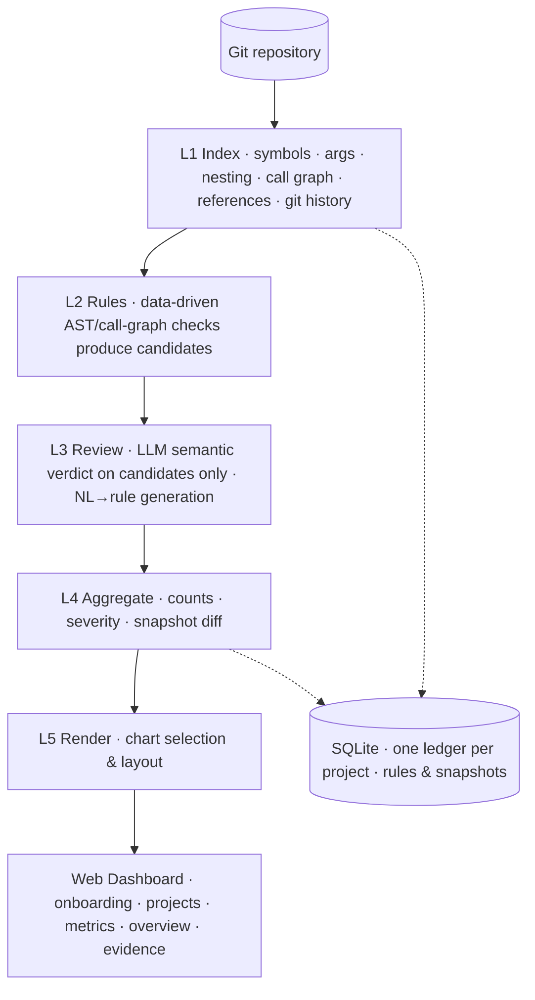

# 🔭 Debtscope · 债镜

**AI-powered technical debt dashboard for your codebase.**
Connect a model, pick a project, define metrics in plain language — then watch debt trend with every commit.

**一句话，看清你的代码欠了多少债。** 配置模型 → 选择本地项目初始化监控 → AI 甄别技术债、自然语言生成自定义指标 → 可视化看板随每次提交跟踪增减。

> Debtscope answers three questions teams cannot today: **how much** debt do we have, **where** exactly is it, and are we getting **better or worse**?

- **零第三方依赖**：纯 Python 标准库实现，`git clone` 即可运行
- **确定性内核 + Agent 外壳**：AST/调用图规则做全量粗筛，LLM 只精判 1%–5% 的候选，便宜、快、可复核
- **指标即数据**：内置规则可停用/调阈值/调严重度，8 类指标可在界面上自助新增，或**一句话让 AI 生成**，保存前先试跑预览
- **多项目托管**：一个看板切换监控多个本地仓库，数据各自独立、全部留在本机

---

## Why Debtscope

| | SonarQube | AI coding assistants | Manual review | **Debtscope** |
|---|---|---|---|---|
| Whole-repo inventory | ✅ | ❌ (edit-time only) | ❌ | ✅ |
| Natural-language custom metrics | ❌ write plugins | partial | ❌ | ✅ AI → rule, with dry-run preview |
| Custom rules editable in the UI | ❌ | ❌ | ❌ | ✅ create / edit / disable / delete |
| Semantic dead-vs-entry-point judgment | ❌ syntax rules | ✅ but no repo-wide view | ✅ not repeatable | ✅ hybrid |
| Iteration-over-iteration trend narrative | weak | ❌ | ❌ | ✅ first-class |
| Multi-project dashboard | ❌ heavyweight server | ❌ | ❌ | ✅ local registry |
| Traceable evidence + confidence levels | partial | weak | ✅ | ✅ |
| Zero-dependency, runs locally | ❌ | ✅ | — | ✅ stdlib only |

## Screenshots

<p align="center">
  
</p>

*① First launch is a 3-step guide: connect a model → pick a project → initialize monitoring. Defaults to **豆包 / 火山方舟 with the unified `doubao-seed-evolving` model** (Agent & Coding optimized, always the latest release); 15 other presets — Qwen, GLM, Kimi, Hunyuan, ERNIE, MiniMax, MiMo, SiliconFlow, OpenAI, Gemini, Grok, Mistral, Ollama, custom — are one dropdown away. Live connection test included; local endpoints need no key.*

<p align="center">
  
</p>

*② Give a local repository path; Debtscope builds the index and runs the first scan (initializes monitoring). Monitored projects appear as cards and stay in the top-bar switcher.*

<p align="center">
  
</p>

*③ Health score ring, this-scan delta (new vs eliminated), severity donut, rule-type distribution, score trend and a filterable findings table — with project switcher, metric manager and model badge in the top bar.*

<p align="center">
  
</p>

*④ Metric manager: toggle built-in metrics, tune thresholds and severity, or add team-specific ones. Built-in metrics can be reset to defaults; custom metrics can be deleted.*

<p align="center">
  
</p>

*⑤ Describe a metric in one sentence — “ban print debugging”, “functions must not exceed 80 lines”, “class names must be PascalCase” — AI compiles it into a parameterized rule. **Dry-run preview against the current index before saving**; the scan reruns automatically afterwards.*

<p align="center">
  
</p>

*Click any finding to expand code context with the offending line highlighted, review verdict, fix suggestion and one-click triage (confirm / false-positive / wontfix). Deep-linkable via `#finding-<id>`.*

## How it works

Debtscope does **not** feed your whole repository to an LLM. Deterministic work stays deterministic; the model only judges a small candidate set — which keeps scans cheap, fast, and trustworthy.



**Anti-hallucination defenses**

1. **Structure first** — no finding without structural evidence from the index/call graph.
2. **Three-part evidence** — every finding links to file, line, code snippet and reference chain.
3. **Confidence levels** — high / medium (needs human glance) / low (folded, excluded from score).
4. **Feedback loop** — marking a false positive suppresses it on every future scan.
5. **AI-generated rules are never trusted blindly** — they compile into the same deterministic checkers as built-in rules, and you must dry-run them on your code before saving.

Dead-code findings are honestly worded as *“no call/reference found by static analysis, please confirm”* — reflection, dynamic dispatch and framework callbacks can never be fully ruled out statically.

### Deterministic core, agentic shell

The agent shell (`debtscope.harness`) follows the **Agent = Model + Harness** paradigm popularized by DeepSeek Harness: pluggable model adapters, a project registry, tool contracts, and traceable runs — but the built-in rules stay on the deterministic fast path (fast, free, zero-hallucination). Model calls are reserved for what only a model can do: semantic dead-code review and turning natural language into parameterized rules. See **[docs/harness-architecture.md](docs/harness-architecture.md)** for the full blueprint (micro-kernel, tool registry, ReAct loop, session traces, plugin strategy, security model).

## Quickstart

Requires Python 3.10+. **Zero third-party dependencies** (standard library only).

```bash
git clone https://github.com/debtscope/debtscope
cd debtscope

# start the web app — the 3-step guide walks you through model → project → first scan
python -m debtscope serve
```

1. **Connect a model** — the guide defaults to 豆包 / 火山方舟 with model `doubao-seed-evolving`; just paste your Ark API key (or switch to DeepSeek / OpenAI / a local Ollama endpoint, which needs no key). The guide tests the connection before continuing.
2. **Pick a project** — enter an absolute path to a local repository to initialize monitoring (first scan runs immediately).
3. **Dashboard** — switch between monitored projects from the top bar any time; **＋ 添加项目…** adds more.

CLI-only / CI usage:

```bash
pip install -e .
debtscope config                 # one-time interactive model setup
debtscope scan /path/to/repo     # requires a configured model (AI review enabled)
debtscope scan /path/to/repo --no-llm   # static-only fallback for CI / offline
debtscope serve                  # web app (optionally: debtscope serve /path/to/repo)
```

> A model is required by design — Debtscope is an AI-first product and refuses to silently present unreviewed static results as the default experience. `--no-llm` remains as an explicit offline/CI escape hatch.

### Model configuration

```bash
debtscope config        # guided wizard, saves to ~/.debtscope/config.json (chmod 600)
debtscope doctor        # verify config and connectivity any time
```

16 built-in presets, all speaking the OpenAI Chat Completions protocol. The guide defaults to **豆包/火山方舟**; pick any other from the dropdown — base URL and model are pre-filled and editable.

| Provider | API base | Default model |
|---|---|---|
| **豆包 / 火山方舟** (default) | `https://ark.cn-beijing.volces.com/api/v3` | `doubao-seed-evolving` |
| DeepSeek | `https://api.deepseek.com/v1` | `deepseek-chat` |
| 阿里通义千问 / 百炼 | `https://dashscope.aliyuncs.com/compatible-mode/v1` | `qwen3-coder-plus` |
| 智谱 GLM | `https://open.bigmodel.cn/api/paas/v4` | `glm-5.3` |
| Kimi / 月之暗面 | `https://api.moonshot.cn/v1` | `kimi-k2.6` |
| 腾讯混元 | `https://api.hunyuan.cloud.tencent.com/v1` | `hunyuan-turbo` |
| 百度千帆 / 文心 | `https://qianfan.baidubce.com/v2` | `ernie-4.5-turbo-128k` |
| MiniMax | `https://api.minimax.chat/v1` | `MiniMax-M2.5` |
| 小米 MiMo | `https://api.xiaomimimo.com/v1` | `mimo-v2.5-pro` |
| 硅基流动 SiliconFlow (aggregator) | `https://api.siliconflow.cn/v1` | `Qwen/Qwen3-Coder-480B-A35B-Instruct` |
| OpenAI | `https://api.openai.com/v1` | `gpt-5.5` |
| Google Gemini | `https://generativelanguage.googleapis.com/v1beta/openai/` | `gemini-3.5-flash` |
| xAI Grok | `https://api.x.ai/v1` | `grok-4.6` |
| Mistral | `https://api.mistral.ai/v1` | `mistral-large-latest` |
| Ollama (local, no key) | `http://127.0.0.1:11434/v1` | `qwen2.5-coder:7b` |
| Custom | any OpenAI-compatible endpoint (gateway, vLLM, LM Studio…) | — |

Model IDs are common current releases as of 2026-09 — type any newer/dated model name (or an Ark `ep-xxxx` endpoint id) into the model field. Local endpoints (`127.0.0.1` / `localhost`) work without a key.

Environment variables override the file (handy for CI):

```bash
export DEBTSCOPE_API_BASE="https://ark.cn-beijing.volces.com/api/v3"
export DEBTSCOPE_API_KEY="your-ark-api-key"   # also reads OPENAI_API_KEY / OPENAI_API_BASE
export DEBTSCOPE_MODEL="doubao-seed-evolving"
```

In the web app, click the model badge in the top bar to edit configuration at any time.

## Metrics & rules

### 7 built-in metrics (Python)

| Rule | Severity | What it catches |
|---|---|---|
| `unused_function` | medium | functions/methods with no call or reference anywhere in the repo (framework decorators, dunders, tests, abstract methods excluded; LLM-refined when configured) |
| `swallowed_exception` | medium | bare `except`, or `except: pass` that silently swallows errors |
| `mutable_default_argument` | medium | `def f(x=[])` and friends — shared mutable defaults |
| `open_without_context` | medium | `open()` outside a `with` block, leaking handles on error paths |
| `long_function` | low | functions over 50 lines |
| `todo_accumulation` | low | files with 5+ TODO/FIXME comments |
| `duplicate_function` | low | structurally identical function bodies (copy-paste), robust to renamed variables |

### 8 metric types you can add yourself

| Kind | Parameters | Example |
|---|---|---|
| `function_too_long` | max lines | 函数不超过 80 行 |
| `file_too_long` | max lines | 单文件不超过 500 行 |
| `too_many_args` | max args | 函数参数不超过 5 个 |
| `nested_too_deep` | max depth | 嵌套不超过 4 层 |
| `todo_accumulation` | max count | 单文件 TODO 不超过 3 个 |
| `duplicate_function` | min lines / stmts | 调小粒度，抓更短的复制粘贴 |
| `forbidden_call` | comma-separated names | 禁止 `print,eval,os.system` |
| `name_convention` | target + regex + message | 类名必须大驼峰、函数必须 snake_case |

Every custom metric is a row in the same rule engine as built-in ones — no special execution path. The **AI assist** box compiles a sentence into `{kind, severity, params}`; you then **dry-run preview** it against the current index (hit count + sample locations) before saving.

Inspect from the CLI: `debtscope rules` lists built-in metrics and creatable kinds.

## Multi-project storage

```
~/.debtscope/
├── config.json            # model config (chmod 600)
├── projects.json          # monitored project registry
└── data/<project-id>.db   # one SQLite ledger per project (rules, findings, snapshots)
```

Project IDs are content-derived from the absolute path, so registering the same path twice is idempotent. Nothing is uploaded anywhere.

## CLI

```bash
debtscope serve [path]    # web dashboard; optionally register & focus a project
debtscope scan <path>     # index, analyze, reconcile findings, record a snapshot
        --no-llm          # static-only mode, no model calls (CI / offline)
        --db <path>       # override ledger path
debtscope config          # interactive model/endpoint wizard (also --show, --provider …)
debtscope doctor          # check config and model connectivity
debtscope rules           # list built-in metrics and creatable kinds
```

## Roadmap

- **v0.1** ✅ Python AST backend, 7 built-in metrics, SQLite ledger, web dashboard
- **v0.2** ✅ model config wizard (CLI + web), provider presets, connectivity test, `debtscope.harness` package
- **v0.3** ✅ config-first 3-step onboarding, multi-project registry, data-driven rule engine, UI metric manager (create/edit/disable/delete/reset), 8 creatable metric kinds, AI rule generation with dry-run preview
- **v0.4** — micro-kernel + tool registry + multi-step ReAct loop (evidence-fetching review, conversational metric tuning), run/trace JSONL & traces page
- **v0.5** — language-backend plugin seam + tree-sitter (Java / Go / JS/TS), token-cost dashboard
- **v0.6** — CI headless mode (`--ci`, SARIF output, quality-gate exit codes); repo groups & aggregate rollups
- **later** — runtime-coverage cross-check for dead code, autofix with diff review, optional `dsh-plugin-debtscope` bundle

See [docs/design-v2.md](docs/design-v2.md) for the product/technical design and
[docs/harness-architecture.md](docs/harness-architecture.md) for the harness blueprint.

## Privacy

Everything runs on your machine. Source code is read locally; the only network
calls are LLM requests to the endpoint you configure. Point it at an internal
gateway and no code ever leaves your network. Keys are stored only in
`~/.debtscope/config.json` with `chmod 600`.

## License

[MIT](LICENSE)
