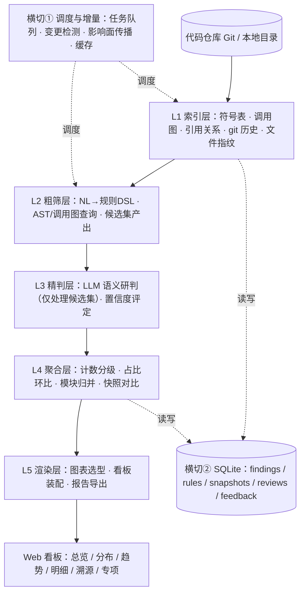
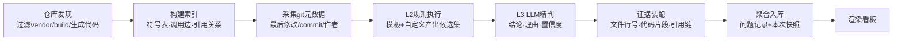
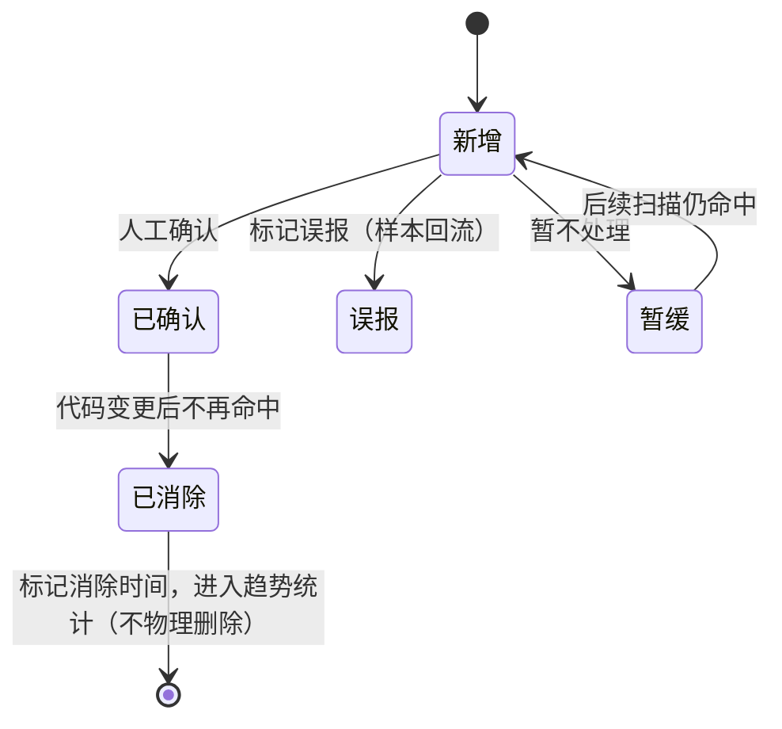

# 代码技术债看板 Agent｜产品文档 + 技术设计文档（v2 优化版）

> **版本说明**：本版在 v1 基础上做了结构性收敛——
> 产品定位从「代码监控面板 / 质量治理 Runtime / 私有化 Harness」三重身份，收敛为 **AI 驱动的代码技术债看板**；
> 技术方案从「全 LLM 扫描」修正为 **「静态索引粗筛 + LLM 候选集精判」的混合架构**；
> 并补齐了低幻觉机制、规则 DSL、数据模型、增量扫描、成本模型、MVP 边界、技术风险与成功指标。

---

# 一、产品文档（PRD）

## 1. 产品定位

### 1.1 一句话定位

**AI 驱动的代码技术债看板：用一句话定义你关心的代码维度，Agent 自动扫描仓库、聚合指标、生成看板，并随每次提交持续跟踪技术债的增减。**

### 1.2 我们解决什么问题

研发团队普遍知道「项目里有技术债」，但回答不了三个问题：

1. **有多少**：废弃代码、重复逻辑、不规范写法到底分布在哪、量级多大？
2. **在哪**：具体是哪个文件、哪一行、哪段调用链？
3. **在变好还是变坏**：这个迭代是还了债，还是又欠了新债？

现有工具的缺口：

| 现有方案 | 缺口 |
|---|---|
| SonarQube 等静态扫描工具 | 规则固定、配置门槛高、只给问题清单不给趋势叙事；自定义规则要写代码 |
| AI 代码助手（Copilot/Cursor） | 解决「写代码」，不解决「看清存量代码」，没有全量视图 |
| APM（Prometheus/Grafana/ARMS） | 监控运行时指标，看不到静态代码结构里的技术债 |
| 人工 Code Review | 只覆盖增量、依赖人、无法全量、无法持续 |

### 1.3 我们不做什么（产品边界）

v1 明确不做，避免摊大饼：

- ❌ 不做运行时 APM / 链路追踪 / 线上告警
- ❌ 不做代码自动修复（只定位、给证据、给建议，修复由人完成）
- ❌ 不做 CI/CD 质量门禁（v2 再评估）
- ❌ 不做多仓库集团级治理、细粒度权限、插件市场（v2/v3）
- ❌ 不做完全自由形态的拖拽式 BI（看板由 Agent 生成，用户做有限调整）

### 1.4 设计理念

- **先看清，再治理**：第一价值是让技术债「可见、可量化、可对比」，而不是一上来替人改代码
- **模板兜底、自然语言进阶**：不让用户面对一个空白输入框发呆
- **证据先于结论**：每条问题都能点回具体代码行和引用链，没有证据的结论不展示
- **趋势比快照重要**：首页回答「在变好还是变坏」，而不是「现在有多少」
- **混合而不是迷信模型**：确定性的事交给静态分析，需要语义判断的事才交给 LLM

## 2. 目标用户与场景

### 2.1 目标用户（按优先级）

| 优先级 | 用户 | 核心诉求 | 使用频率 |
|---|---|---|---|
| P0 | 后端研发（个人/小组） | 看清自己负责模块的技术债、清理废弃代码 | 每周 / 每次迭代 |
| P0 | 技术 Leader / 架构师 | 团队质量趋势、迭代对比、风险模块定位 | 每次迭代 / 双周 |
| P1 | 效能 / 质量团队 | 统一质量视图、规范落地情况 | 月度 |

### 2.2 核心场景（按价值排序）

1. **迭代质量回顾**：迭代结束一键生成「本迭代技术债增量 / 清理量」对比看板，用于复盘
2. **存量技术债盘点**：新接手项目或季度盘点时，全量扫描废弃代码、重复逻辑、风险写法的分布
3. **专项风险排查**：上线前 / 专项治理时，自定义排查 Redis 过期策略、并发锁、未捕获异常、资源未释放
4. **编码规范落地**：把团队约定（如「所有 IO 操作必须捕获异常」）变成可持续扫描的指标
5. **个人模块自检**：开发者定期清理自己模块的废弃方法、TODO 堆积

## 3. 核心产品能力

### 3.1 代码多维分析（混合扫描）

五大维度，v1 优先落地前三个 + 后两个的典型规则：

- **生命周期**：废弃方法 / 类、长期未调用代码、TODO/FIXME 堆积、被注释的代码块
- **冗余重复**：重复代码块、复制粘贴逻辑、冗余判空、死代码分支
- **健壮性风险**：资源未关闭、异常被吞、参数校验缺失、返回值不统一
- **缓存规范**：Redis Key 未设过期时间、缓存穿透风险写法
- **并发安全**：锁粒度不当、锁未在 finally 释放、非线程安全集合误用

每条发现统一输出：问题类型、文件路径、行号、风险等级、**置信度**、**证据引用链**、修复建议。

### 3.2 两层自定义指标

- **模板层（默认入口）**：内置 15~20 个开箱即用模板，一键启用
- **自然语言层（进阶）**：用户描述需求 → Agent 翻译成结构化规则 → **先回显规则让用户确认**（例：「你是不是想找：所有 Controller 中包含 UPDATE 但未加 @Transactional 的方法？」）→ 小范围试跑给出预估命中量 → 确认后正式执行

### 3.3 自动生成看板

Agent 根据指标类型自动选图、排版：

- **总览**：健康度评分、问题总数、各等级占比、较上次净变化（首页顶部）
- **分布**：按模块 / 目录柱状图、问题类型饼图
- **趋势**：按扫描快照的折线图（首页核心位置）
- **明细**：可筛选、可排序、可溯源的问题表格
- **专项**：每个自定义规则生成独立子面板，与通用大盘并存

### 3.4 代码溯源与治理闭环

- 点击任一问题 → 展开代码片段 + 上下文 + 引用链（谁在调用 / 全仓无调用）
- 人工标记：**确认问题 / 误报 / 暂不处理**，支持备注与优先级调整
- 标记持久化，后续扫描不重复打扰；误报样本用于同类规则自动降权

### 3.5 随提交动态更新

- 手动触发，或监听本地 git 提交后提示增量扫描
- 已修复自动下线、新问题自动入库、历史快照永久保留
- 看板顶部始终展示「较上次：新增 X / 消除 Y / 净变化 Z」

## 4. 差异化对比

| 能力 | 本产品 | SonarQube | AI 代码助手 | 人工 Review |
|---|---|---|---|---|
| 全量存量扫描 | ✅ | ✅ | ❌（偏增量） | ❌ |
| 自然语言自定义规则 | ✅ 一句话 | ❌ 需写插件 | 部分 | ❌ |
| 语义级判断（真废弃 vs 反射调用） | ✅ 混合研判 | ❌ 语法规则 | ✅ 但无全量视图 | ✅ 不可持续 |
| 迭代趋势叙事 | ✅ 首页核心 | 弱 | ❌ | ❌ |
| 结论可溯源 + 置信度 | ✅ | 部分 | 弱 | ✅ |
| 零配置启动 | ✅ 单二进制 | ❌ 需部署 | ✅ | — |
| 边际成本 | 低 | 中 | 订阅费 | 高（人力） |

> **一句话差异化：SonarQube 给你一张问题清单，我们给你一个会讲故事、能对话、随代码生长的技术债看板。**

## 5. MVP 范围与版本规划

### 5.1 v1 MVP：单仓库、本地运行、跑通闭环

| 模块 | 范围 |
|---|---|
| 仓库接入 | 本地 Git 仓库 / 目录，首发聚焦 1~2 种主力语言（Java / Go 视团队技术栈） |
| 规则 | 15~20 个内置模板 + 自然语言自定义（规则回显确认） |
| 分析 | 索引 → 粗筛 → LLM 精判，输出带证据和置信度的问题清单 |
| 存储 | 本地 SQLite（问题、规则、快照、审核、反馈） |
| 看板 | Web UI：总览、分布、趋势、明细、溯源、专项子面板 |
| 更新 | 手动触发 + git 提交后提示增量扫描 |
| 部署 | 单个可执行文件 + 本地 Web 控制台，模型端点可配置（公有 API / 私有端点） |

### 5.2 v2：团队协作与工程化

- CI/CD 集成、质量门禁、MR 自动评论
- 多仓库与仓库分组、全局总览
- **运行时覆盖率接入**（JaCoCo / pprof），静态 + 动态交叉验证废弃代码
- 规则市场与团队规则共享、基础成员权限

### 5.3 v3：企业私有化 Runtime

- 插件化微内核、私有化一键部署、离线模型适配
- 细粒度权限、审计日志、SSO
- 技术债 SLA 与治理工单流

> v1 文档中的「对标 DeepSeek Harness 的私有化 Runtime、插件市场、多仓分组、双层权限」整体后移至 v3——**先验证核心价值，再做平台化。**

## 6. 核心交互流程（用户视角）

1. **启动接入**：启动 Agent → 选择本地仓库 → 首次全量索引（进度可见）
2. **选 / 建指标**：首页推荐模板，勾选启用；或直接输入自然语言需求
3. **规则确认**（自定义场景）：Agent 回显结构化规则、扫描范围、预估命中量，用户确认或修正
4. **查看结果**：总览 → 下钻分布 → 打开明细 → 点击溯源代码
5. **审核处理**：逐条确认 / 误报 / 暂缓，误报即时反馈
6. **持续跟踪**：迭代末再次扫描，首页直接看增量对比，导出复盘报告

---

# 二、技术设计文档

## 1. 整体架构

### 1.1 五层数据流 + 两个横切子系统



**关键原则：LLM 只出现在 L3，且输入是粗筛后的小候选集；L1 / L2 / L4 全部是确定性计算。** 这是成本、速度、可信度三者同时成立的前提。

### 1.2 为什么不用「全 LLM 扫描」

- 50 万行的中型仓库无法整体塞进上下文，全量喂给 LLM 成本高、耗时长
- 「这个函数有没有被调用」恰恰是静态分析的强项、LLM 的弱项
- 计数、去重、环比这类确定性任务交给模型，只会平白引入幻觉

## 2. 核心流程

### 2.1 首次全量扫描



### 2.2 自然语言 → 可执行规则

1. LLM 将用户描述翻译为**结构化规则 DSL**
2. 系统做可执行性校验：维度 / 过滤器是否合法、预估扫描范围
3. **回显确认**：用自然语言复述规则 + 展示扫描目录 + 预估命中量级
4. 确认后规则持久化，后续扫描自动执行

### 2.3 规则 DSL（示意）

```yaml
rule:
  name: redis_key_without_ttl
  scope: "**/*Cache*.java"
  detect:
    any:
      - call: "redisTemplate.opsForValue().set"
        without_arg: "timeout"
      - call: "stringRedisTemplate.set"
        without_arg: ["timeout", "Duration"]
  llm_review: true          # 粗筛后是否需要 LLM 语义精判
  severity: medium
  desc: "Redis 写入未设置过期时间，存在永久驻留风险"
```

- 模板规则由官方预置并验证；自定义规则由 LLM 生成 DSL、用户确认后保存
- DSL 同时是「可解释凭证」：用户随时能看到 Agent 到底在扫什么，不是黑盒

## 3. 关键技术方案

### 3.1 低幻觉机制（产品可信度的生命线）

四道防线，层层兜底：

1. **静态先行**：结论必须能在索引 / 调用图中找到结构性依据，LLM 不允许无候选凭空报问题
2. **三段式证据**：每条结论强制携带 `文件:行号` + 代码片段 + 引用链（调用方列表，或「全仓无调用」的查询结果）
3. **置信度分级**：
   - **高**：静态证据充分 + LLM 确认 → 默认展示，计入健康分
   - **中**：静态命中 + LLM 推测（如疑似反射 / 动态代理场景）→ 展示但标注「需人工确认」
   - **低**：仅 LLM 判断 → 默认折叠，不计入健康分
4. **误报反馈闭环**：用户标记误报 → 记录规则 + 代码特征 → 同规则相似命中自动降权 / 抑制；高误报率规则在 v2 规则市场降权

**诚实的能力边界**：静态分析无法识别反射、动态代理、序列化、注解驱动、RPC 入口等隐式调用。因此「废弃代码」类结论的产品文案统一表述为 **「静态分析未发现调用，建议人工确认」**，而非断言「已废弃」。v2 接入运行时覆盖率数据后再提升判定等级。

### 3.2 增量扫描

- **文件指纹**：内容 hash + 符号级指纹，仅变更文件重建索引
- **影响面传播**：沿调用图反向传播，只重跑受影响的规则与符号
- **精判缓存**：代码片段未变化的候选不重复调用 LLM
- **问题状态机**：



### 3.3 数据模型（SQLite 核心表）

| 表 | 关键字段 | 用途 |
|---|---|---|
| `repos` | 仓库路径、当前版本指纹 | 仓库登记 |
| `symbols` | 名称、类型、文件、起止行、hash、最后修改 commit | 符号索引 |
| `references` | 调用方符号 → 被调用方符号 | 调用 / 引用边 |
| `rules` | DSL、来源（模板/自定义）、启用状态、严重度 | 规则库 |
| `findings` | 规则、符号、文件、行号、等级、置信度、证据 JSON、状态、首末次发现时间 | 问题台账 |
| `snapshots` | 扫描时间、commit、各维度计数 | 趋势快照（趋势查询走此表，避免重算） |
| `reviews` | 问题 ID、状态、备注、操作人、时间 | 人工审核 |
| `feedback` | 规则、代码特征、误报标签 | 误报样本 |

### 3.4 可视化渲染

- 前端按**固定卡片模板**渲染（健康分、增量条、饼图、柱图、折线、明细表）；LLM 只输出「看板装配方案 JSON」（用哪些卡片、绑定哪个指标、如何排序），**不让 LLM 生成前端代码**（不可控且有注入风险）
- 图表使用 ECharts / Recharts 等成熟库
- 支持有限交互：时间范围切换、模块筛选、卡片显隐、排序；不做自由拖拽 BI
- 溯源视图：语法高亮代码片段 + 引用链列表，点击可跳转文件

### 3.5 模型适配

- 统一模型适配接口：`chat / 结构化输出 / 批量并发 / 超时重试`
- v1 支持公有模型 API 与企业私有推理端点（OpenAI 兼容协议）
- 精判 prompt 模板版本化管理；输出强制 JSON Schema 校验，解析失败自动重试，仍失败则降级为「待人工确认」，绝不展示臆造结论

## 4. 成本模型（必须算清的账）

LLM 成本只发生在 L3 精判，且与**候选数量**而非代码总量成正比：

- 粗筛目标：把候选集压缩到全量符号的 **1%~5%**（经验目标，需在第 0 步实测校准）
- 单次精判 ≈ 候选片段 + 上下文，控制在 1~4K tokens，批量并发
- 增量扫描只对变更影响面付费，且未变化片段走缓存，成本随迭代趋稳
- 产品内提供**成本看板**：本次精判 N 条、消耗 tokens、预估费用
- 提供省成本档位：「仅高严重度走 LLM，其余只做静态扫描」

## 5. 部署形态

- **v1：单二进制本地版**。一条命令启动、SQLite 本地落盘、浏览器打开控制台
- 代码敏感团队只需把模型端点配置为**内网推理地址**，即可实现代码不出网，无需专门的私有化版本
- v3 再提供完整私有化 Runtime（微内核 + 插件 + 权限 + 审计），不在 v1 背负

## 6. 技术风险与对策

| 风险 | 影响 | 对策 |
|---|---|---|
| 多语言解析覆盖不足 | 适用面受限 | v1 聚焦 1~2 种主力语言，基于 Tree-sitter 增量扩展 |
| LLM 误判废弃代码 | 信任崩塌 | 置信度分级 + 诚实文案 + 误报闭环 + v2 运行时数据校验 |
| 大仓库首次索引慢 | 首次体验差 | 进度可视化、后台索引、分目录渐进出结果 |
| NL 生成规则不可执行 / 语义偏差 | 自定义能力翻车 | DSL 校验 + 规则回显 + 小范围试跑预估命中量 |
| LLM 成本超预期 | 难以持续 | 粗筛压缩比、严重度分档、精判缓存 |
| 生成代码 / 第三方代码污染结果 | 噪声大 | 默认排除 vendor、build、generated，支持配置 |

## 7. 成功指标（验证产品是否成立）

- **结果可信度**：高置信结论的人工确认率 ≥ 85%，整体误报率 ≤ 10%
- **自定义成功率**：自然语言需求从输入到「规则确认并跑出结果」的完成率 ≥ 80%
- **扫描性能**：10 万行代码首次索引 ≤ 5 分钟（目标，实测校准）；增量扫描 ≤ 30 秒
- **留存信号**：连续 3 个迭代产生快照对比的活跃仓库占比 ≥ 50%
- **治理闭环**：被确认问题在 2 个迭代内被消除的比例（验证看板是否真的驱动了治理）

---

# 三、落地路线图

| 阶段 | 内容 | 目的 |
|---|---|---|
| **第 0 步：可行性验证（1~2 天）** | 挑一个真实中型开源仓库，手工跑通「索引 → 一条规则粗筛 → LLM 精判 → 出一张图」 | 实测**粗筛压缩比、误判率、token 成本**三个决定方案生死的数字 |
| **第 1 步：最小闭环** | 单语言、10 个模板规则、总览 + 明细 + 溯源 | 跑通主链路 |
| **第 2 步：补齐核心差异** | 趋势对比、自然语言自定义、审核 / 误报闭环 | 建立差异化 |
| **第 3 步：工程化** | 第二语言、增量扫描、报告导出 | 达到日常可用 |
| 第 4 步起 | 评估团队化、CI 集成、私有化 | 验证后再投入 |

> **第 0 步是整个路线图里最重要的一步**：如果粗筛压缩比做不到 5% 以内、或高置信误判率高于 15%，需要回头调整架构，而不是直接投入 MVP 开发。

---

# 四、Slogan（候选）

1. **一句话，看清你的代码欠了多少债**
2. **扫一遍仓库，AI 把技术债画成看板**
3. **代码技术债看板：零配置生成，随提交自动更新**

---

# 附：相对 v1 的主要变更

1. **定位收敛**：三重身份 → 单一的「代码技术债看板」；私有化 Runtime / 多仓分组 / 插件市场后移至 v3
2. **架构修正**：六层概念分层 → 「索引 - 粗筛 - 精判 - 聚合 - 渲染」五层数据流，LLM 只做候选集精判
3. **补齐关键设计**：低幻觉四道防线、规则 DSL、SQLite 数据模型、增量扫描状态机、成本模型、技术风险、成功指标
4. **产品重心调整**：趋势对比提升为首页核心；自定义规则增加「回显确认」；新增模板层降低使用门槛
5. **能力边界诚实化**：废弃代码从「AI 精准识别」改为「静态疑似 + 置信度 + 人工确认」，v2 用运行时数据补强
6. **部署务实化**：从「第一步就对标 Harness 私有化」改为「单二进制本地版起步，配置内网端点即可满足代码不出网」
